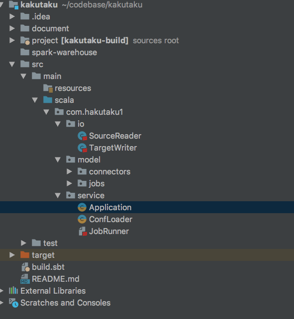
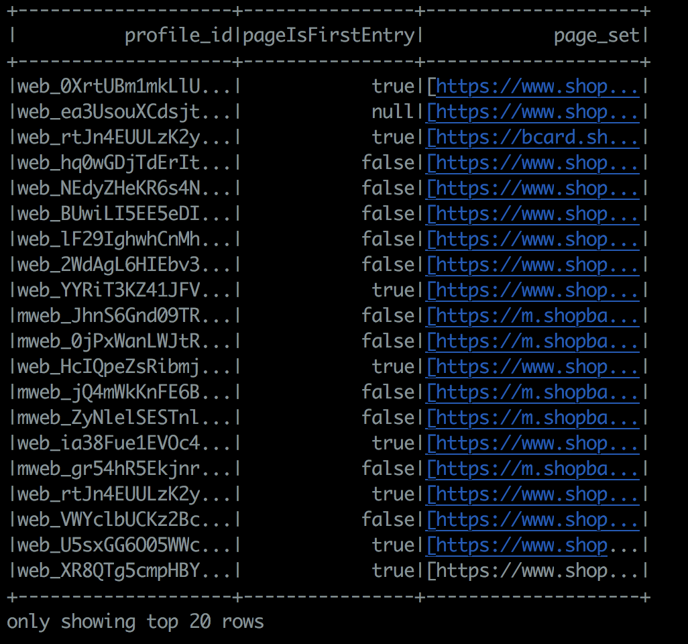

## Data processing and save to redis

### Design and implementation
Using spark SQL handling all ETL logics.  
Modeling the business logic as Source,Target,Connector, Job, Reader and Writer.  
Parameterize the ETL jobs.   

### Project structure

### Test data
Configurations are now specified in Application class, from where the test data and corresponding SQL files are 
set.

### Run
`sbt "runMain com.hakutaku1.service.Application"`  

Screenshot of out1:

### Future work
Make all the configurations as external file(json or yaml)